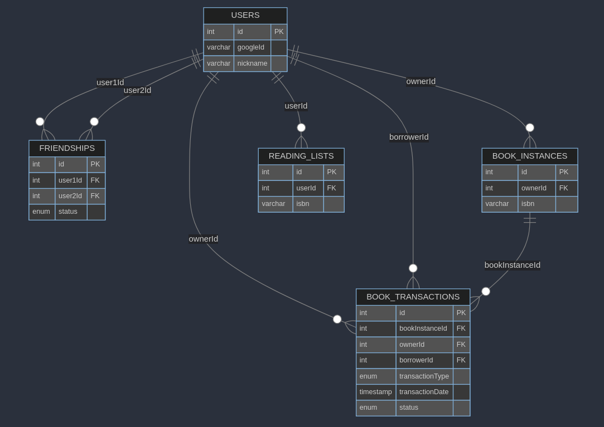
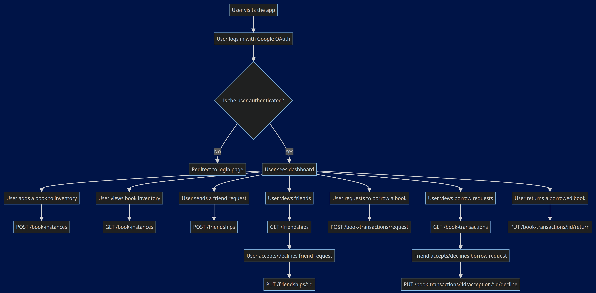

# Libreria

Books are knowledge, and knowledge deserves to be free.
Think free as in libre, not gratis.

Libreria is a platform that allows you to lend the books you own, but are not using at the moment, to your friends who are interested in reading them.

## Setup

```bash
npm i
docker compose up -d
npm run start
```

## Env variables

```Env
GOOGLE_CLIENT_ID=           # google client ID and Secret from console.cloud.google.com for OAuth
GOOGLE_CLIENT_SECRET=
SESSION_SECRET=libreria
DB_PASS=postgres
DB_USER=postgres
PORT=3000
```

## Baza de date



## Flowchart



## Endpoints

### Authentication

#### Google OAuth

- **GET /auth/google**

  Redirects to Google OAuth for authentication.

- **GET /auth/google/callback**

  Callback URL after Google authentication.

### Users

#### Get User by ID

- **GET /users/:id**

  Returns user information.

  **Parameters:**
  - `id` (path): The ID of the user.

  **Responses:**
  - `200 OK`: Returns the user information.
  - `404 Not Found`: User not found.
  - `401 Unauthorized`: User not authenticated.

#### Update User

- **PUT /users/:id**

  Updates user information.

  **Parameters:**
  - `id` (path): The ID of the user.

  **Request Body:**
  - `nickname` (string): The new nickname of the user.

  **Responses:**
  - `200 OK`: Returns the updated user information.
  - `400 Bad Request`: Validation error.
  - `401 Unauthorized`: User not authenticated.
  - `404 Not Found`: User not found.

#### Delete User

- **DELETE /users/:id**

  Deletes a user.

  **Parameters:**
  - `id` (path): The ID of the user.

  **Responses:**
  - `200 OK`: User deleted successfully.
  - `401 Unauthorized`: User not authenticated.
  - `404 Not Found`: User not found.

### Book Instances

#### Add Book Instance

- **POST /book-instances**

  Adds a book instance to the user's inventory.

  **Request Body:**
  - `isbn` (string): The ISBN of the book.

  **Responses:**
  - `201 Created`: Book instance added successfully.
  - `400 Bad Request`: Validation error or user not authenticated.
  - `500 Internal Server Error`: Failed to add book instance.

#### Get All Book Instances

- **GET /book-instances**

  Returns all book instances owned by the user.

  **Responses:**
  - `200 OK`: Returns the list of book instances.
  - `401 Unauthorized`: User not authenticated.
  - `500 Internal Server Error`: Failed to fetch book instances.

#### Update Book Instance

- **PUT /book-instances/:id**

  Updates a book instance in the user's inventory.

  **Parameters:**
  - `id` (path): The ID of the book instance.

  **Request Body:**
  - `isbn` (string): The new ISBN of the book.

  **Responses:**
  - `200 OK`: Book instance updated successfully.
  - `400 Bad Request`: Validation error or user not authenticated.
  - `404 Not Found`: Book instance not found or does not belong to the user.
  - `500 Internal Server Error`: Failed to update book instance.

#### Delete Book Instance

- **DELETE /book-instances/:id**

  Deletes a book instance from the user's inventory.

  **Parameters:**
  - `id` (path): The ID of the book instance.

  **Responses:**
  - `200 OK`: Book instance deleted successfully.
  - `401 Unauthorized`: User not authenticated.
  - `404 Not Found`: Book instance not found or does not belong to the user.
  - `500 Internal Server Error`: Failed to delete book instance.

### Friendships

#### Add Friendship

- **POST /friendships**

  Sends a friend request to another user.

  **Request Body:**
  - `user2Id` (integer): The ID of the user to send the friend request to.

  **Responses:**
  - `201 Created`: Friend request sent successfully.
  - `400 Bad Request`: Validation error or user not authenticated.
  - `500 Internal Server Error`: Failed to send friend request.

#### Get All Friendships

- **GET /friendships**

  Returns all friendships of the user.

  **Responses:**
  - `200 OK`: Returns the list of friendships.
  - `401 Unauthorized`: User not authenticated.
  - `500 Internal Server Error`: Failed to fetch friendships.

#### Update Friendship Status

- **PUT /friendships/:id**

  Updates the status of a friendship.

  **Parameters:**
  - `id` (path): The ID of the friendship.

  **Request Body:**
  - `status` (enum): The new status of the friendship (`pending`, `accepted`, `declined`).

  **Responses:**
  - `200 OK`: Friendship status updated successfully.
  - `400 Bad Request`: Validation error or user not authenticated.
  - `404 Not Found`: Friendship not found or not authorized to update.
  - `500 Internal Server Error`: Failed to update friendship status.

#### Delete Friendship

- **DELETE /friendships/:id**

  Deletes a friendship.

  **Parameters:**
  - `id` (path): The ID of the friendship.

  **Responses:**
  - `200 OK`: Friendship deleted successfully.
  - `401 Unauthorized`: User not authenticated.
  - `404 Not Found`: Friendship not found or not authorized to delete.
  - `500 Internal Server Error`: Failed to delete friendship.

### Reading Lists

#### Add to Reading List

- **POST /reading-lists**

  Adds a book to the user's reading list.

  **Request Body:**
  - `isbn` (string): The ISBN of the book.

  **Responses:**
  - `201 Created`: Book added to reading list successfully.
  - `400 Bad Request`: Validation error or user not authenticated.
  - `500 Internal Server Error`: Failed to add book to reading list.

#### Get Reading List

- **GET /reading-lists**

  Returns the user's reading list.

  **Responses:**
  - `200 OK`: Returns the reading list.
  - `401 Unauthorized`: User not authenticated.
  - `500 Internal Server Error`: Failed to fetch reading list.

#### Remove from Reading List

- **DELETE /reading-lists/:id**

  Removes a book from the user's reading list.

  **Parameters:**
  - `id` (path): The ID of the reading list entry.

  **Responses:**
  - `200 OK`: Book removed from reading list successfully.
  - `401 Unauthorized`: User not authenticated.
  - `404 Not Found`: Reading list entry not found or not authorized to delete.
  - `500 Internal Server Error`: Failed to remove book from reading list.

### Book Transactions

#### Request to Borrow a Book

- **POST /book-transactions/request**

  Sends a request to borrow a book.

  **Request Body:**
  - `bookInstanceId` (integer): The ID of the book instance to borrow.

  **Responses:**
  - `201 Created`: Borrow request sent successfully.
  - `400 Bad Request`: Validation error, book not available, or user not authenticated.
  - `403 Forbidden`: User is not friends with the book owner.
  - `500 Internal Server Error`: Failed to create borrow request.

#### Accept Borrow Request

- **PUT /book-transactions/:id/accept**

  Accepts a pending borrow request.

  **Parameters:**
  - `id` (path): The ID of the borrow request.

  **Responses:**
  - `200 OK`: Borrow request accepted successfully.
  - `401 Unauthorized`: User not authenticated.
  - `404 Not Found`: Borrow request not found or not authorized to accept.
  - `500 Internal Server Error`: Failed to accept borrow request.

#### Decline Borrow Request

- **PUT /book-transactions/:id/decline**

  Declines a pending borrow request.

  **Parameters:**
  - `id` (path): The ID of the borrow request.

  **Responses:**
  - `200 OK`: Borrow request declined successfully.
  - `401 Unauthorized`: User not authenticated.
  - `404 Not Found`: Borrow request not found or not authorized to decline.
  - `500 Internal Server Error`: Failed to decline borrow request.

#### Return a Borrowed Book

- **PUT /book-transactions/:id/return**

  Returns a borrowed book.

  **Parameters:**
  - `id` (path): The ID of the borrow transaction.

  **Responses:**
  - `200 OK`: Book returned successfully.
  - `401 Unauthorized`: User not authenticated.
  - `404 Not Found`: Borrow transaction not found or not authorized to return.
  - `500 Internal Server Error`: Failed to return book.
